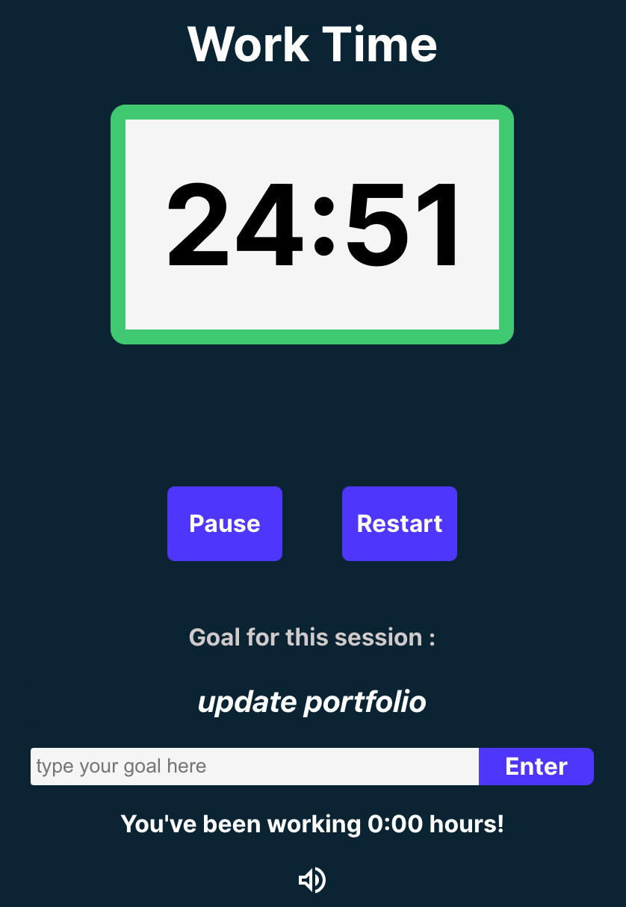
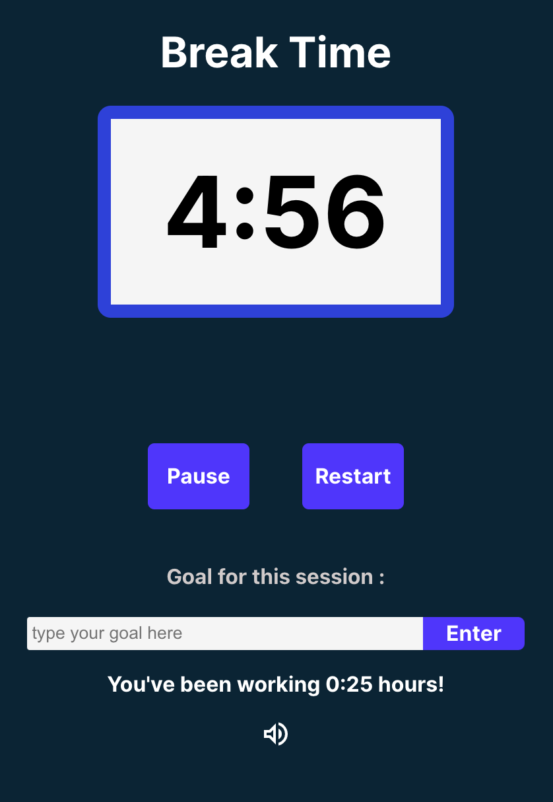

# Pomedoro App - Component Overview README

## Introduction

The Pomedoro app is a custom-built Pomodoro timer designed for enhanced personal productivity. It integrates features such as a work time log, pause functionality, and goal setting. This README provides a walkthrough of the key components that make up the app.

*Caption: The working interface of the Pomedoro app.*

*Caption: Break in the Pomedoro app.*

## Component Breakdown

### App.js (Main Component)
- **Description**: Serves as the root component that encapsulates all other components of the application.
- **Key Features**: Manages the main state and serves as the entry point for the application.

### Buttons.js (Control Buttons)
- **Description**: Handles the rendering of control buttons like Start/Restart and Pause.
- **Functionality**: 
  - Start/Restart Button: Initiates or restarts the timer.
  - Pause Button: Allows the user to pause the ongoing timer.

### Ding.js (Alert Sound)
- **Description**: Manages the sound alert functionality for the timer.
- **Implementation**: Plays an audio clip when the timer reaches zero, signaling the end of a Pomodoro session.

### Goal.js (Goal Setting)
- **Description**: Provides an interface for users to set and display their goals.
- **Usage**: Helps users stay focused by displaying their current goal during the Pomodoro session.

### Timer.js (Pomodoro Timer)
- **Description**: The core component that implements the Pomodoro timer.
- **Functionality**: 
  - Uses `useState` to manage timer state.
  - Implements `useEffect` for timer countdown functionality.
  - Handles the display of the remaining time in the Pomodoro session.

### Tracker.js (Working Time Log)
- **Description**: Tracks and logs the total time a user has spent working.
- **Features**: 
  - Logs time upon completion of each Pomodoro session.
  - Displays the accumulated time to give users insight into their work duration.

## React Hooks Used

- **useState**: Manages state in a functional component. Used across multiple components for tracking states like timer duration, pause status, and goals.
- **useEffect**: Executes side effects in functional components. Used in Timer.js for handling countdown logic.
- **useRef**: Accesses DOM elements directly. Useful in managing focus without re-rendering components.

## Installation and Running the App

1. Clone the repository: `git clone https://github.com/LurieK/pomedoro.git`
2. Move to the project directory: `cd pomedoro`
3. Install dependencies: `npm install`
4. Start the application: `npm start`

## Conclusion

